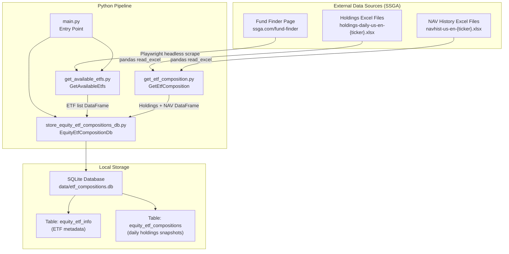
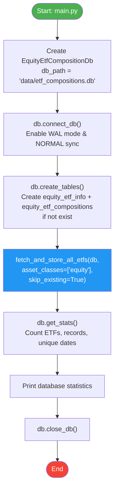
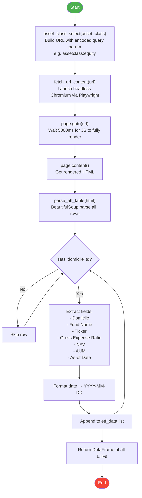
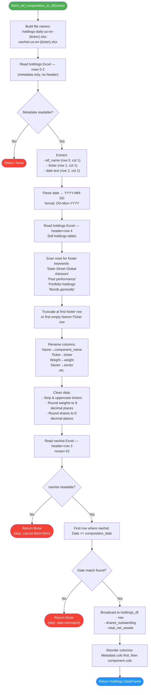
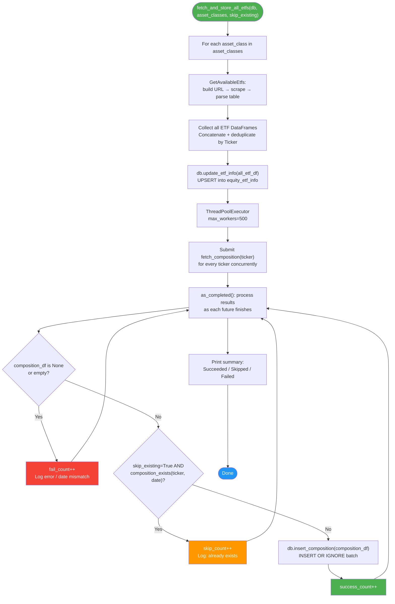
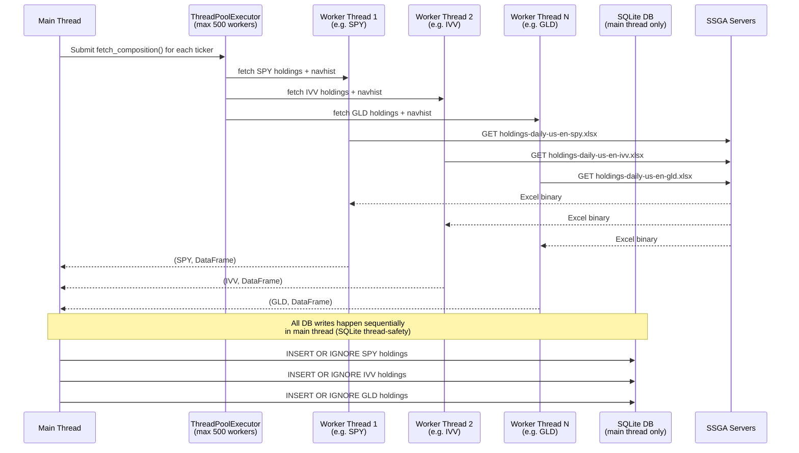
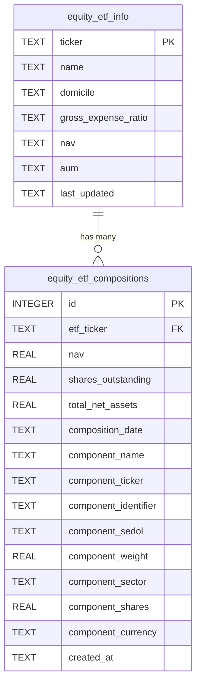

# StateStreet ETFs Tracker

A Python pipeline that automatically scrapes, fetches, and stores daily holdings (composition) snapshots for State Street Global Advisors (SSGA) ETFs into a local SQLite database. It supports all SSGA asset classes — equity, fixed-income, alternative, and multi-asset — and is designed to run daily to build a historical record of ETF compositions over time.

---

## Table of Contents

- [Overview](#overview)
- [Project Structure](#project-structure)
- [Architecture & Workflow Diagrams](#architecture--workflow-diagrams)
  - [High-Level System Architecture](#high-level-system-architecture)
  - [Main Execution Flow](#main-execution-flow)
  - [ETF Discovery Workflow](#etf-discovery-workflow-getavailableetfs)
  - [ETF Composition Fetch Workflow](#etf-composition-fetch-workflow-getetfcomposition)
  - [Database Storage Workflow](#database-storage-workflow-equityetfcompositiondb)
  - [Concurrency Model](#concurrency-model)
  - [Database Schema](#database-schema)
- [Modules](#modules)
- [Data Sources](#data-sources)
- [Installation](#installation)
- [Usage](#usage)
- [Configuration](#configuration)
- [Database Reference](#database-reference)
- [Asset Classes](#asset-classes)

---

## Overview

Every trading day, SSGA publishes updated Excel files listing the holdings of each of their ETFs. This tracker automates:

1. **Discovery** — Scraping the SSGA fund finder page (with full JavaScript rendering via Playwright) to get the live list of all available ETFs for a given asset class.
2. **Fetching** — Downloading the daily holdings `.xlsx` file and NAV history `.xlsx` file for every discovered ETF directly from SSGA's CDN.
3. **Validation** — Cross-checking that the holdings date and the NAV date are in sync before storing.
4. **Storage** — Batch-inserting the validated data into a local SQLite database with duplicate prevention.

---

## Project Structure

```
StateStreet_ETFs_Tracker/
├── main.py                            # Entry point — orchestrates the full pipeline
├── get_available_etfs.py              # Scrapes ssga.com for the list of available ETFs
├── get_etf_composition.py             # Downloads and parses per-ETF holdings Excel files
├── store_equity_etf_compositions_db.py # SQLite DB manager + concurrent fetch orchestrator
├── useful_functions.py                # Date utility helpers
├── requirements.txt                   # Python dependencies
└── data/
    └── etf_compositions.db            # SQLite database (auto-created on first run)
```

---

## Architecture & Workflow Diagrams

### High-Level System Architecture



---

### Main Execution Flow



---

### ETF Discovery Workflow (`GetAvailableEtfs`)



**Scraped Fields per ETF:**

| Field | Source HTML Class | Description |
|---|---|---|
| Domicile | `td.domicile` | Fund domicile country |
| Name | `td.fundName` | Full fund name |
| Ticker | `td.fundTicker` | Exchange ticker symbol |
| Gross Expense Ratio | `td.ter` | Annual fee % |
| NAV | `td.nav` | Net Asset Value |
| AUM | `td.aum` | Assets Under Management |
| Date | `td.asOfDate` | Data as-of date |

---

### ETF Composition Fetch Workflow (`GetEtfComposition`)



**Output DataFrame Columns:**

| Column | Source | Description |
|---|---|---|
| `etf_name` | Holdings metadata row 0 | Full ETF name |
| `etf_ticker` | Holdings metadata row 1 | ETF ticker |
| `composition_date` | Holdings metadata row 2 | Holdings as-of date (YYYY-MM-DD) |
| `number_of_holdings` | Computed | Total number of components |
| `nav` | navhist Excel | Net Asset Value on composition date |
| `shares_outstanding` | navhist Excel | Shares outstanding on composition date |
| `total_net_assets` | navhist Excel | Total net assets on composition date |
| `component_name` | Holdings col `Name` | Component security name |
| `ticker` | Holdings col `Ticker` | Component ticker |
| `identifier` | Holdings col `Identifier` | CUSIP or ISIN |
| `sedol` | Holdings col `SEDOL` | SEDOL identifier |
| `weight` | Holdings col `Weight` | Portfolio weight (decimal, 8dp) |
| `sector` | Holdings col `Sector` | GICS sector |
| `shares` | Holdings col `Shares Held` | Number of shares held |
| `currency` | Holdings col `Local Currency` | Component currency |

---

### Database Storage Workflow (`EquityEtfCompositionDb`)



---

### Concurrency Model



> **Why this design?** Network I/O (downloading Excel files from SSGA) is the bottleneck. By using up to 500 concurrent worker threads for HTTP fetches, total runtime is reduced from `O(n * fetch_time)` to roughly `O(fetch_time)`. All SQLite writes are kept on the main thread to avoid SQLite concurrency issues.

---

### Database Schema



**Indexes on `equity_etf_compositions`:**

| Index Name | Columns | Purpose |
|---|---|---|
| `idx_compositions_etf_date` | `(etf_ticker, composition_date)` | Fast lookup for a specific ETF on a specific date |
| `idx_compositions_date` | `(composition_date)` | Fast cross-ETF queries for a given date |
| `idx_compositions_component` | `(component_ticker)` | Fast lookup of which ETFs hold a specific stock |

**Unique Constraint:** `(etf_ticker, composition_date, component_identifier)` — prevents duplicate records even if the pipeline is run multiple times on the same day.

---

## Modules

### `main.py`

Entry point. Creates the database, initializes tables, runs the full pipeline, prints stats, and closes the connection.

```python
db = EquityEtfCompositionDb(db_path="data/etf_compositions.db")
db.connect_db()
db.create_tables()
fetch_and_store_all_etfs(db, asset_classes=["equity"], skip_existing=True)
stats = db.get_stats()
db.close_db()
```

---

### `get_available_etfs.py` — `GetAvailableEtfs`

Scrapes the SSGA fund finder page to discover all available ETFs for a given asset class.

| Method | Description |
|---|---|
| `asset_class_select(asset_class)` | Builds the filtered fund-finder URL |
| `fetch_url_content(url, wait_time=5000)` | Renders the JavaScript-heavy page using headless Chromium via Playwright |
| `parse_etf_table(html)` | Parses the rendered HTML into a pandas DataFrame |

**Why Playwright?** The SSGA fund finder page is a JavaScript Single-Page Application (SPA). A plain `requests.get()` call returns an empty shell. Playwright launches a real Chromium browser, waits for the JS to execute and populate the table, then captures the fully-rendered HTML.

---

### `get_etf_composition.py` — `GetEtfComposition`

Downloads and parses the two Excel files published daily by SSGA for each ETF.

| Method | Description |
|---|---|
| `fetch_etf_composition_to_df(ticker)` | Full pipeline: download holdings Excel + navhist Excel, validate dates, return merged DataFrame |

**File URL pattern:**
```
https://www.ssga.com/us/en/intermediary/library-content/products/fund-data/etfs/us/
  holdings-daily-us-en-{ticker_lowercase}.xlsx
  navhist-us-en-{ticker_lowercase}.xlsx
```

**Excel layout for holdings file:**

```
Row 0: [Label]  [ETF Name]
Row 1: [Label]  [Ticker]
Row 2: [Label]  [As of DD-Mon-YYYY]
Row 3: (blank)
Row 4: Name | Ticker | Identifier | SEDOL | Weight | Sector | Shares Held | Local Currency  ← header
Row 5+: component data rows
...
[footer text rows — truncated before storing]
```

---

### `store_equity_etf_compositions_db.py` — `EquityEtfCompositionDb` + `fetch_and_store_all_etfs`

SQLite database manager and top-level orchestration function.

**`EquityEtfCompositionDb` methods:**

| Method | Description |
|---|---|
| `connect_db()` | Open SQLite connection; enable WAL journal mode for better concurrent reads |
| `close_db()` | Close the connection |
| `create_tables()` | Create both tables and all indexes if they don't exist |
| `update_etf_info(df)` | Batch-upsert ETF metadata into `equity_etf_info` |
| `insert_composition(df)` | Batch-insert holdings rows into `equity_etf_compositions` (INSERT OR IGNORE) |
| `get_available_tickers()` | Return all tracked ETF tickers |
| `get_composition_dates(ticker?)` | Return distinct dates, optionally filtered by ticker |
| `get_composition(ticker, date)` | Return holdings DataFrame for a specific ETF + date |
| `get_latest_composition(ticker)` | Return the most recent holdings for an ETF |
| `composition_exists(ticker, date)` | Check if a record already exists (used to skip re-fetching) |
| `get_stats()` | Return total ETF count, total record count, unique date count |
| `purge_old_compositions(days=1825)` | Delete records older than N days and VACUUM the DB |

**`fetch_and_store_all_etfs` function:**

Top-level function that ties everything together: discovers ETFs, concurrently fetches all compositions, and stores results in the DB.

---

### `useful_functions.py`

Lightweight date utility helpers.

| Function | Description |
|---|---|
| `current_date()` | Returns today's date as `YYYY-MM-DD` string |
| `previous_date(date_str?)` | Returns the previous **business day** (Mon–Fri) as `YYYY-MM-DD` string, skipping weekends |

---

## Data Sources

| Source | URL | Method | Format |
|---|---|---|---|
| SSGA Fund Finder | `https://www.ssga.com/us/en/intermediary/fund-finder` | Playwright (headless Chromium) | HTML (JS-rendered) |
| Daily Holdings | `https://www.ssga.com/us/en/intermediary/library-content/products/fund-data/etfs/us/holdings-daily-us-en-{ticker}.xlsx` | `pandas.read_excel` | Excel (.xlsx) |
| NAV History | `https://www.ssga.com/us/en/intermediary/library-content/products/fund-data/etfs/us/navhist-us-en-{ticker}.xlsx` | `pandas.read_excel` | Excel (.xlsx) |

---

## Installation

### 1. Clone the repository

```bash
git clone https://github.com/your-username/StateStreet_ETFs_Tracker.git
cd StateStreet_ETFs_Tracker
```

### 2. Create and activate a virtual environment (recommended)

```bash
python -m venv venv
source venv/bin/activate   # macOS/Linux
venv\Scripts\activate      # Windows
```

### 3. Install Python dependencies

```bash
pip install -r requirements.txt
```

`requirements.txt` includes:
```
pip install playwright
playwright install chromium
```

You will also need:
```bash
pip install pandas openpyxl beautifulsoup4
```

### 4. Install Playwright's Chromium browser

```bash
playwright install chromium
```

### 5. Create the data directory

```bash
mkdir -p data
```

The SQLite database (`data/etf_compositions.db`) is created automatically on first run.

---

## Usage

### Run the full pipeline

```bash
python main.py
```

This will:
1. Scrape SSGA for all available equity ETFs
2. Download holdings + NAV history for each ETF concurrently
3. Store everything in `data/etf_compositions.db`
4. Print a summary

**Example output:**
```
============================================================
Fetching equity ETFs...
============================================================
Found 132 equity ETFs

Total unique ETFs: 132
Upserted 132 ETF info records.

Fetching compositions concurrently with up to 500 workers...

[1/132] Processing SPY...
  Stored 503 holdings for SPY (date: 2026-03-12)
[2/132] Processing IVV...
  Skipping IVV - composition for 2026-03-12 already exists
...

============================================================
Summary:
  Successfully stored: 118
  Skipped (existing): 8
  Failed: 6
  Failed tickers: XYZ, ...
============================================================

Database Statistics:
  Total ETFs tracked: 132
  Total composition records: 58,714
  Unique composition dates: 1
```

### Run ETF discovery only

```python
from get_available_etfs import GetAvailableEtfs

get = GetAvailableEtfs()
url = get.asset_class_select("equity")
content = get.fetch_url_content(url)
df = get.parse_etf_table(content)
print(df)
```

### Fetch a single ETF's composition

```python
from get_etf_composition import GetEtfComposition

get = GetEtfComposition()
df = get.fetch_etf_composition_to_df("SPY")
print(df.head())
```

### Query the database

```python
from store_equity_etf_compositions_db import EquityEtfCompositionDb

db = EquityEtfCompositionDb("data/etf_compositions.db")
db.connect_db()

# Get latest SPY holdings
spy_holdings = db.get_latest_composition("SPY")
print(spy_holdings[['component_name', 'component_ticker', 'component_weight']].head(10))

# Get all tickers tracked
tickers = db.get_available_tickers()

# Get all dates with data for QQQ
dates = db.get_composition_dates("QQQ")

# Database stats
stats = db.get_stats()
print(stats)

db.close_db()
```

---

## Configuration

All configuration is done in `main.py`:

| Parameter | Default | Description |
|---|---|---|
| `db_path` | `"data/etf_compositions.db"` | Path to the SQLite database file |
| `asset_classes` | `["equity"]` | Asset classes to fetch. Options: `"equity"`, `"fixed-income"`, `"alternative"`, `"Multi-Asset"` |
| `skip_existing` | `True` | If `True`, skip ETFs whose composition for today already exists in the DB. Set to `False` to force re-fetch. |

To track multiple asset classes, edit `main.py`:

```python
fetch_and_store_all_etfs(
    db,
    asset_classes=["equity", "fixed-income", "alternative", "Multi-Asset"],
    skip_existing=True
)
```

To purge old data (default keeps 5 years / 1825 days):

```python
db.purge_old_compositions(days_to_keep=365)  # Keep only 1 year
```

---

## Database Reference

### `equity_etf_info`

Stores relatively-static ETF metadata. Updated on every pipeline run via upsert.

| Column | Type | Description |
|---|---|---|
| `ticker` | TEXT (PK) | ETF ticker symbol |
| `name` | TEXT | Full fund name |
| `domicile` | TEXT | Fund domicile |
| `gross_expense_ratio` | TEXT | Annual expense ratio |
| `nav` | TEXT | Net Asset Value (from fund finder page) |
| `aum` | TEXT | Assets Under Management |
| `last_updated` | TEXT | Timestamp of last upsert |

### `equity_etf_compositions`

Stores daily holdings snapshots. Grows by ~500–2000 rows per ETF per trading day.

| Column | Type | Description |
|---|---|---|
| `id` | INTEGER (PK) | Auto-increment primary key |
| `etf_ticker` | TEXT (FK) | Parent ETF ticker |
| `nav` | REAL | ETF NAV on composition date |
| `shares_outstanding` | REAL | Total shares outstanding |
| `total_net_assets` | REAL | Total net assets (USD) |
| `composition_date` | TEXT | Holdings as-of date (YYYY-MM-DD) |
| `component_name` | TEXT | Holding security name |
| `component_ticker` | TEXT | Holding security ticker |
| `component_identifier` | TEXT | CUSIP or ISIN |
| `component_sedol` | TEXT | SEDOL identifier |
| `component_weight` | REAL | Portfolio weight (decimal, 8dp) |
| `component_sector` | TEXT | GICS sector |
| `component_shares` | REAL | Number of shares held |
| `component_currency` | TEXT | Local currency of holding |
| `created_at` | TEXT | Row insert timestamp |

---

## Asset Classes

| Asset Class String | Description |
|---|---|
| `"equity"` | Stock/equity ETFs (e.g. SPY, XLK, GLD) |
| `"fixed-income"` | Bond ETFs (e.g. AGG, TLT, LQD) |
| `"alternative"` | Alternative investment ETFs |
| `"Multi-Asset"` | Multi-asset / balanced ETFs |
